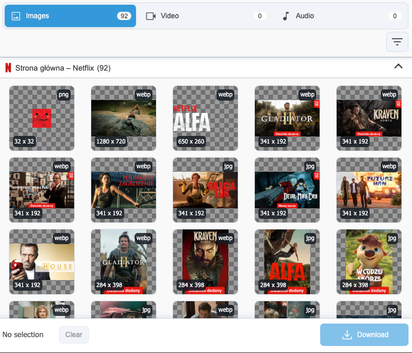
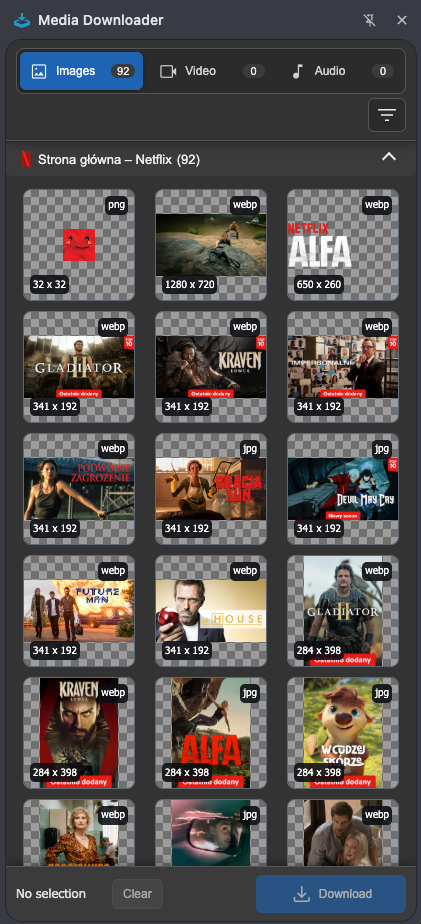
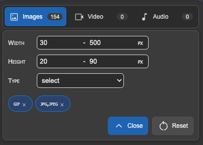
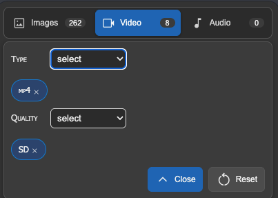
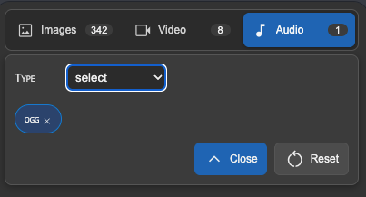
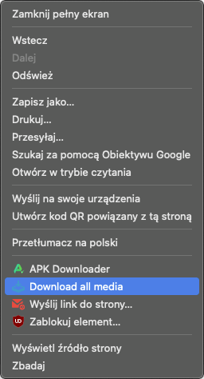
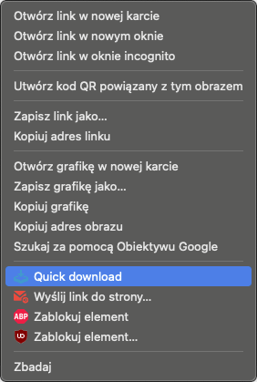

# Media Downloader

Media Downloader is a Chrome extension for finding, filtering, and downloading media assets from web pages. It collects embedded and linked images, video, and audio detected from the current page, groups results by browser tab, and gives you a focused popup or side panel for reviewing files before downloading them.

<p align="center">
  
</p>

<p align="center">
  <a href="https://chromewebstore.google.com/detail/media-downloader/aklijicmhlmfioogfbemefilfdffijcl">
    
    <strong>Install from Chrome Web Store</strong>
  </a>
</p>

## Preview

<p align="center">
  
</p>

<p align="center">
  
</p>

## Features

- Browse embedded images, video, and audio found on the current page.
- Detect many directly linked media files and CORS-readable linked pages with standard media metadata.
- Use the extension as a compact popup or a persistent Chrome side panel.
- Filter images by width, height, and file type.
- Filter videos by format and detected quality.
- Show only filter values that are actually available in the found media.
- Select individual files, batch-select multiple files, and download selected items.
- Shift-click a media tile to select a visible range.
- Use context menu actions for quick downloads without opening the panel.
- Choose light, dark, or system theme.

## Filters

<p align="center">
  
  
  
</p>

## Context Menu

<p align="center">
  
  
</p>

## Installation For Development

1. Clone the repository.
2. Install dependencies inside the extension directory:

```bash
cd extension
npm install
```

3. Build the extension:

```bash
npm run build
```

4. Open Chrome and go to `chrome://extensions`.
5. Enable `Developer mode`.
6. Click `Load unpacked`.
7. Select the `extension` directory.

## Development

Run Webpack in watch mode:

```bash
cd extension
npm run start
```

Create a production build:

```bash
cd extension
npm run build
```

The generated bundles are written to `extension/dist`.

## Packaging

Chrome Web Store packages must contain `manifest.json` at the root of the ZIP file. Build first, then create the package from inside the `extension` directory:

```bash
cd extension
npm run build
zip -r releases/media-downloader-2.2.0.zip manifest.json css dist images views
```

## Project Structure

```text
.
├── docs/
│   └── images/          GitHub README and landing page assets
├── extension/
│   ├── css/             Extension styles
│   ├── dist/            Webpack output
│   ├── images/          Extension icons and UI assets
│   ├── src/             TypeScript source
│   ├── views/           Extension HTML views
│   └── manifest.json    Chrome extension manifest
└── landing/             Static landing page
```

## Browser Support

The main extension targets Chrome Manifest V3 and uses Chrome APIs such as `sidePanel`, `scripting`, `downloads`, `storage`, and `contextMenus`.

Chromium-based browsers may support many of the same APIs, but behavior can differ. Firefox support requires a separate WebExtension build because Firefox does not use Chrome's `sidePanel` API in the same way.

## Store Policy Notes

Media Downloader does not bypass DRM, paywalls, authentication, private file permissions, or browser restrictions. Some websites intentionally hide, stream, or protect media in ways that browser extensions cannot expose as a single downloadable file. Some websites and stores restrict downloading media from specific platforms, including YouTube. The extension follows browser API permissions and skips pages that cannot be scripted, such as browser internal pages and extension store pages.
